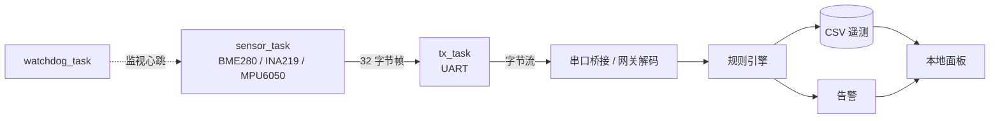

# Edge Health Monitor

[](https://github.com/shjhijoaj/edge-health-monitor/actions/workflows/ci.yml)
[](LICENSE)

面向小型设备的边缘健康监测系统：C 语言协议库与 FreeRTOS 固件、C++17 边缘网关、实时监控面板。全部功能在本机即可跑通，不依赖任何在线服务。


## 功能

**设备端**

- 定长二进制帧：同步字节、版本、消息类型、序号、长度、负载与 CRC16 校验
- 逐字节解码状态机，错帧可识别并重新同步
- BME280 / INA219 / MPU6050 寄存器级驱动，覆盖温度、湿度、电流与振动
- I2C 总线抽象：驱动只依赖 `probe` / `write` / `read`，可替换为 STM32 HAL

**固件**

- FreeRTOS 四任务：采样（100 ms）、串口发送、健康上报（1 s）、看门狗
- 任务间只通过队列传递数据，串口只在发送任务中访问
- 看门狗检测采样心跳超时后经 AIRCR 触发系统复位，复位计数保存在 `.noinit` 段
- 交叉编译产物约 7.9 KB Flash / 24.9 KB RAM，可在 QEMU 的 Cortex-M3 上运行

**网关与面板**

- UART/RS485 字节流解析、CSV 遥测落盘、JSON 消息生成
- 四类告警：温度、电流、振动、传感器状态
- 面板展示设备在线状态、温度趋势、告警列表与最近采样，2 秒刷新
- HTTP 接口写入采样，便于与外部系统对接
- 统一阈值配置 `config/thresholds.cfg`，网关与面板读取同一份

**数据接入**

- 串口（真实设备）、TCP（网络串口或仿真器）、离线回放三种模式
- 自动识别二进制帧与十六进制文本流
- 连接中断后按间隔自动重连，不会退出

## 架构



## 快速开始

需要 CMake 3.16 以上与 C99/C++17 编译器。

```bash
cmake -S . -B build -DCMAKE_BUILD_TYPE=Release
cmake --build build --parallel
ctest --test-dir build --output-on-failure          # 3 组用例：协议、网关、传感器
./build/edge_health_sim telemetry.csv               # 主机模拟器：24 条采样
```

Windows 下用 Visual Studio 生成器时，把最后两步换成 `cmake --build build --config Release`、`ctest --test-dir build -C Release` 与 `build\Release\edge_health_sim.exe`。

启动监控面板（会先启动持续采集的模拟设备）：

```powershell
pwsh -NoProfile -ExecutionPolicy Bypass -File tools/run_local.ps1
```

打开 <http://127.0.0.1:8765/>，按 `Ctrl+C` 同时停止面板与模拟设备。完整参数见 [`docs/local-operation.md`](docs/local-operation.md)。

在 QEMU 中运行真实固件：

```powershell
C:\msys64\usr\bin\pacman.exe -S --noconfirm --needed mingw-w64-ucrt-x86_64-arm-none-eabi-gcc mingw-w64-ucrt-x86_64-qemu
pwsh -NoProfile -ExecutionPolicy Bypass -File tools\sim\build_firmware.ps1
pwsh -NoProfile -ExecutionPolicy Bypass -File tools\sim\run_emulation.ps1 -Image watchdog -Seconds 90
```

FreeRTOS 内核已内置在 `firmware/third_party/`，克隆后无需额外下载。

## 验证

```powershell
pwsh -NoProfile -ExecutionPolicy Bypass -File tools\verify_all.ps1
```

一次跑完 Python 语法检查、MSVC 与 GCC 两套主机测试、固件交叉编译、QEMU 看门狗演示，结果写入 `docs/evidence/verify-summary.json`。

| 项目 | 结果 |
| --- | --- |
| 主机测试（MSVC / GCC） | 3 组用例全部通过，两套编译器结果一致 |
| 固件交叉编译 | 两个镜像均通过，无警告 |
| QEMU 看门狗演示 | 244 帧、错帧 0、看门狗复位 3 次，故障注入后完整复位恢复 |
| 稳定性测试（600 秒） | 1202 帧、错帧 0、无看门狗复位 |
| GitHub Actions（Ubuntu） | 主机测试与固件仿真两个任务均通过 |

原始串口日志、帧文件、指标与曲线图在 [`docs/evidence/`](docs/evidence)，完整数据与验收清单在 [`docs/test-report.md`](docs/test-report.md)。

## 项目结构

```text
firmware/include/      MCU 无关的 C 接口
firmware/src/          协议编解码与采样算法
firmware/target/       Cortex-M3 固件：启动代码、板级串口、FreeRTOS 任务
firmware/target/sensors/  传感器驱动、I2C 总线抽象与器件模型
firmware/third_party/  内置 FreeRTOS 内核（MIT）
gateway/               C++17 网关：规则引擎、存储、消息生成、主机模拟器
dashboard/             本地监控面板
config/                统一阈值配置
tests/                 C 与 C++ 回归测试
tools/                 面板服务、串口桥接、日志转换、图表生成
tools/sim/             固件构建与仿真运行脚本（PowerShell 与 bash 各一套）
hardware/              接线说明与器件清单
docs/                  架构、协议、传感器、仿真、运行与测试文档
```

## 部署到硬件

目标平台为 STM32F103C8T6 或 NUCLEO-G071RB，传感器组合为 BME280（温湿度）、INA219（电流）、MPU6050（振动），可选 SSD1306 OLED。接线与器件清单见 [`hardware/`](hardware)。

移植时只需替换总线实现：把 [`i2c_bus_hal.c`](firmware/target/sensors/i2c_bus_hal.c) 接到 CubeMX 生成的 I2C 句柄，传感器驱动、协议层与任务逻辑均无需改动。步骤与实测清单见 [`docs/sensors.md`](docs/sensors.md) 与 [`docs/test-report.md`](docs/test-report.md)。

## 文档

| 文档 | 内容 |
| --- | --- |
| [`docs/architecture.md`](docs/architecture.md) | 分层结构、数据流与已知限制 |
| [`docs/protocol.md`](docs/protocol.md) | 帧格式与字段定义 |
| [`docs/sensors.md`](docs/sensors.md) | 传感器驱动、总线抽象与后端切换 |
| [`docs/emulation.md`](docs/emulation.md) | 在 QEMU 上运行固件的完整流程 |
| [`docs/local-operation.md`](docs/local-operation.md) | 本地运行、接口与数据文件说明 |
| [`docs/test-report.md`](docs/test-report.md) | 测试项、实测数据与硬件验收清单 |

## License

MIT，见 [`LICENSE`](LICENSE)。内置的 FreeRTOS 内核同样为 MIT，来源与更新方式见 [`firmware/third_party/FreeRTOS-Kernel/VENDORED.md`](firmware/third_party/FreeRTOS-Kernel/VENDORED.md)。
