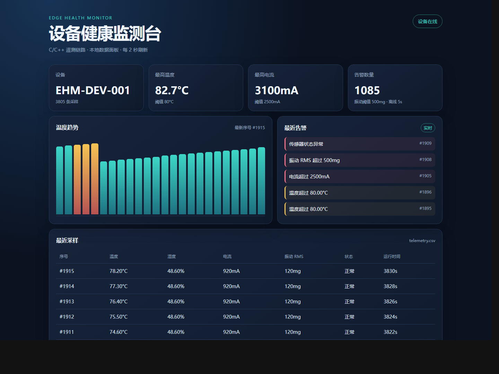

# Edge Health Monitor

[](https://github.com/shjhijoaj/edge-health-monitor/actions/workflows/ci.yml)

设备健康监测系统，包含 C 固件协议库、C++17 边缘网关、串口桥接和本地监控面板。全部功能都能在一台电脑上运行，不依赖任何在线服务。



一个面向小型实验设备的边缘健康监测系统。项目用纯 C 编写设备端协议和采样算法，用 C++17 编写可运行在 Linux/Windows 的边缘网关；没有开发板时可以直接运行主机模拟器，接入 STM32 时只需要替换 HAL 采集层。

它要解决的问题很具体：实验室里的小型电机、电源、泵和测试台通常没有联网能力，温度上升、电流变大、振动加剧这类早期征兆只能靠人工巡检发现。这个项目把采样、校验、存储、告警和可视化串成一条链路，让异常在被肉眼察觉之前就显示出来。

这个项目的重点是把一次传感器采样完整地送到网关：采样值经过定长二进制帧、CRC16 校验和串口字节流解析，网关再完成落盘、阈值告警和 JSON 消息生成（JSON 只是消息格式，真正的 MQTT 上行属于后续接入项，见文档中的说明）。

## 现在能运行什么

- C 协议库：同步字节、版本、消息类型、序号、长度、负载和 CRC16。
- C 采样工具：整数限幅和振动 RMS 计算，适合迁移到 MCU 固件。
- C++ 网关：处理 UART/RS485 字节流、CSV 遥测落盘、温度/电流/振动/传感器状态告警。
- 传感器层：BME280 / INA219 / MPU6050 寄存器级驱动 + I2C 总线抽象，器件模型可在主机上跑测试。
- 主机模拟器：单次或持续生成采样记录，可把原始二进制帧录制下来供离线回放。
- Cortex-M 固件：真实 FreeRTOS 多任务固件，可交叉编译后在 QEMU 的 Cortex-M3 上运行。
- 串口桥接：把真实设备按同一协议发来的字节流解码后写入本地面板。
- 本地面板：实时显示设备在线状态、温度趋势、告警和最近采样记录。
- 统一阈值配置：`config/thresholds.cfg` 同时被 C++ 网关和 Python 面板读取。
- CTest：覆盖协议往返、CRC 错误拒绝、采样工具和告警规则。

## 快速开始

需要 CMake 3.16 以上和 C99/C++17 编译器。完整操作说明见 [`docs/local-operation.md`](docs/local-operation.md)。

```bash
cmake -S . -B build -DCMAKE_BUILD_TYPE=Release
cmake --build build --parallel
ctest --test-dir build --output-on-failure
./build/edge_health_sim telemetry.csv
```

Windows Visual Studio 生成器示例：

```powershell
cmake -S . -B build
cmake --build build --config Release
ctest --test-dir build -C Release --output-on-failure
build\Release\edge_health_sim.exe telemetry.csv
```

模拟器会输出遥测 JSON 和告警，并生成 CSV 文件。默认阈值为 80.00 摄氏度、2500 mA 和 500 mg RMS；这些值集中在 `config/thresholds.cfg`，改一处即可同时影响网关和面板。

## 启动本地监控面板

项目包含一个零依赖的本地 Web 面板。它读取 C++ 网关生成的 `data/telemetry.csv`，展示设备状态、温度趋势、告警和最近采样记录。

PowerShell 中执行：

```powershell
pwsh -NoProfile -ExecutionPolicy Bypass -File tools/run_local.ps1
```

脚本会启动持续采集的 C++ 模拟设备，再启动 Python 标准库 HTTP 服务。然后打开 <http://127.0.0.1:8765/>，面板每 2 秒刷新一次，按 `Ctrl+C` 会同时停止面板和模拟设备。也可以把两个进程分开运行：

```powershell
build\Release\edge_health_sim.exe --loop --interval-ms 1000 --raw data\capture.ehraw data\telemetry.csv
python tools/dashboard_server.py --csv data/telemetry.csv --port 8765
```

## 接入真实设备

设备只要按照 [`docs/protocol.md`](docs/protocol.md) 发送帧，就可以接入同一套面板：

```powershell
pip install pyserial
python tools\serial_bridge.py --port COM3 --baud 115200
```

没有硬件时可以用原始帧回放验证这条路径：

```powershell
python tools\serial_bridge.py --replay data\capture.ehraw
```

如果你手上暂时没有开发板，[`docs/no-hardware-playbook.md`](docs/no-hardware-playbook.md) 给出了用在线 Cortex-M 仿真完成固件验证的完整步骤，以及这个项目能证明什么、不能证明什么。

在线仿真或任意串口打印出的十六进制日志，都能还原成可回放的帧文件：

```powershell
python tools\hexlog_to_raw.py --input serial-log.txt --output data\capture-sim.ehraw --dump
```

任何程序也可以用 HTTP 直接写入一条采样，便于和现有系统对接：

```powershell
Invoke-RestMethod -Method Post -Uri http://127.0.0.1:8765/api/ingest -ContentType 'application/json' -Body '{"sequence":9001,"temperature_c":88.5,"current_ma":2700,"vibration_rms_mg":640,"status":1,"uptime_s":4200}'
```

## 在本地运行 Cortex-M 固件（无需开发板）

没有开发板时，可以让真实固件跑在模拟的 Cortex-M3 处理器上：ARM 交叉编译 → QEMU 执行 → 串口输出帧 → 独立解码器校验 → 回放或实时送进本地面板。

一次跑完全部检查（Python 语法、MSVC 构建测试、GCC 构建测试、固件交叉编译、QEMU 看门狗演示）：

```powershell
pwsh -NoProfile -ExecutionPolicy Bypass -File tools\verify_all.ps1
```

结果会写入 `docs/evidence/verify-summary.json`。

需要 ARM 工具链和 QEMU，通过 MSYS2 安装：

```powershell
C:\msys64\usr\bin\pacman.exe -S --noconfirm --needed mingw-w64-ucrt-x86_64-arm-none-eabi-gcc mingw-w64-ucrt-x86_64-qemu
```

然后两条命令：

```powershell
# 看门狗演示：故意让采样任务卡死，看门狗复位并恢复
pwsh -NoProfile -ExecutionPolicy Bypass -File tools\sim\run_emulation.ps1 -Image watchdog -Seconds 90

# 稳定性测试：不做故障注入，长时间运行
pwsh -NoProfile -ExecutionPolicy Bypass -File tools\sim\run_emulation.ps1 -Image stable -Seconds 600 -NoReplay
```

固件包含四个 FreeRTOS 任务（看门狗、串口发送、采样、健康上报），任务之间只用队列传递数据。运行结果、脚本细节和与真板的差异见 [`docs/emulation.md`](docs/emulation.md)，原始证据在 `docs/evidence/`。

实时接入模拟器或网络串口，不需要先落盘：

```powershell
# 让 QEMU 把串口暴露成 TCP
qemu-system-arm -M lm3s6965evb -cpu cortex-m3 -display none -serial tcp:127.0.0.1:5555,server=on,wait=off -kernel build-firmware/edge_health_firmware.elf

# 桥接工具自动重连并写入面板
python tools\serial_bridge.py --tcp 127.0.0.1:5555
```

桥接工具会自动判断数据是二进制帧还是十六进制文本（固件默认打印文本），也可以显式指定：

```powershell
python tools\serial_bridge.py --tcp 127.0.0.1:5555 --format hex
python tools\serial_bridge.py --port COM3 --baud 115200 --format binary
```

串口或连接中断时，工具会按 `--reconnect-delay`（默认 3 秒）自动重连，不会退出。

## 项目结构

```text
firmware/include/     MCU 无关的 C 接口
firmware/src/         协议编解码与采样算法
firmware/target/      Cortex-M3 固件：启动代码、板级串口、FreeRTOS 任务
firmware/target/sensors/  传感器驱动、I2C 总线抽象与器件模型
gateway/include/      C++ 网关公共接口
gateway/src/          网关、规则引擎和主机模拟器
config/               统一阈值配置
tests/                C 与 C++ 的回归测试
dashboard/            本地监控面板
tools/                本地启动脚本、面板服务、串口桥接
tools/sim/            固件构建与仿真运行脚本
hardware/             接线、器件清单和 STM32 迁移说明
docs/                 架构、协议、测试、本地运行与仿真说明
```

## STM32 迁移路线

当前仓库的核心库不依赖 HAL 或 FreeRTOS，因此可以先在电脑上验证协议和规则，再放进 CubeMX 工程。真实板卡建议使用 STM32F103C8T6 或 NUCLEO-G071RB，传感器组合为 MPU6050、BME280、INA219 和 OLED。

迁移时将传感器读取放进 100 ms 的采样任务，将 `eh_sample_t` 交给 UART 发送任务；UART 中断只负责写入环形缓冲区，协议帧由任务解析。看门狗、传感器超时和 CRC 失败计数在 `docs/architecture.md` 中有明确位置。硬件接线和器件用途见 `hardware/wiring.md`。

## License

本项目采用 MIT License。
